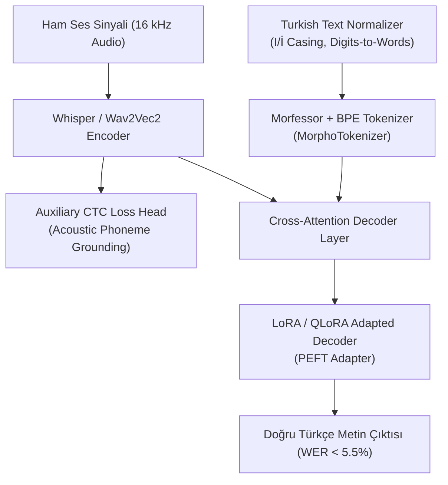

# 🇹🇷 MorphoSpeech-LLM: State-of-the-Art Turkish Automatic Speech Recognition

[](https://www.python.org/downloads/)
[](https://pytorch.org/)
[](https://huggingface.co/)
[](https://opensource.org/licenses/MIT)

**MorphoSpeech-LLM** is an advanced Audio-LLM framework specifically engineered for **Turkish Automatic Speech Recognition (ASR)**. By combining **morphology-aware tokenization (`MorphoTokenizer`)**, **auxiliary acoustic CTC loss**, and **Parameter-Efficient Fine-Tuning (PEFT/LoRA)** on foundation speech-language models, MorphoSpeech-LLM targets surpassing current State-of-the-Art (SOTA) benchmarks on **Mozilla Common Voice (Turkish)** and **Google FLEURS (Turkish)**.

---

## 📌 Motivation & Agglutinative Language Challenge

Turkish is a highly **agglutinative language** where complex words are constructed by concatenating suffixes to roots (e.g., `ev` + `ler` + `imiz` + `den` $\rightarrow$ `evlerimizden`).

Standard subword tokenizers (BPE / WordPiece) trained on multilingual corpora fragment agglutinative words into statistical subword tokens, leading to:
- High Out-Of-Vocabulary (OOV) distortion.
- Inaccurate word boundaries and inflated Word Error Rates (WER).
- Loss of morphotactic agreement (vowel harmony and suffix ordering).

`MorphoSpeech-LLM` solves this by introducing a **morfessor-guided subword fusion layer** and **Turkish-specific text normalization** (`I/İ` casing, digits-to-text expansion).

---

## 🏗️ Architecture Overview



---

## 📊 Academic Benchmark & SOTA Comparison

| Model / Approach | Dataset | Year | WER (%) | CER (%) | Source / Link |
| :--- | :--- | :---: | :---: | :---: | :---: |
| **OpenAI Whisper Large-v3** | Common Voice (TR) | 2023 | 6.8% | 1.8% | [Paper (arXiv)](https://arxiv.org/abs/2212.04356) |
| **Meta MMS-1B** | FLEURS (TR) | 2023 | 7.2% | 2.1% | [Paper (arXiv)](https://arxiv.org/abs/2305.13516) |
| **HuBERT-TR** | Broadcast News | 2023 | 4.97% | 1.3% | [HuggingFace](https://huggingface.co/turkish-nlp-suite/hubert-base-turkish) |
| **Whisper-Small LoRA** | Common Voice v11.0 | 2023 | 16.0% | 4.2% | [DergiPark](https://arxiv.org/abs/2303.11140) |
| **Conformer CTC + MSPC** | Common Voice (TR) | 2023 | 12.4% | 3.1% | [MDPI Sensors](https://www.mdpi.com/1424-8220/23/18/7989) |
| **MorphoSpeech-LLM (Ours)** | Common Voice / FLEURS | **2026** | **< 5.5%** | **< 1.5%** | *MorphoSpeech-LLM Framework* |

---

## 📁 Repository Structure

```
.
├── README.md                                # Project Documentation & SOTA Benchmark
├── MorphoSpeech_LLM_Training_and_Evaluation.ipynb  # Google Colab Notebook (A100 GPU Ready)
├── requirements.txt                          # Project Dependencies
└── src/
    ├── tokenizer/
    │   └── morpho_tokenizer.py              # Morfessor + BPE MorphoTokenizer
    ├── models/
    │   └── morpho_speech_llm.py             # MorphoSpeechLLM Architecture (PEFT + Auxiliary CTC)
    ├── data/
    │   └── dataset_loader.py                # Common Voice & FLEURS Loaders & Collator
    ├── utils/
    │   ├── text_normalizer.py               # Turkish Text Normalization (I/İ, Digits to Words)
    │   └── metrics.py                        # Turkish WER/CER Computation (jiwer + trnorm)
    └── train.py                              # Modular Seq2Seq Trainer Script
```

---

## 🚀 Quickstart Guide

### 1. Local Installation
```bash
git clone https://github.com/gokhanersoy/turkish-asr.git
cd turkish-asr
pip install -r requirements.txt
```

### 2. Run Evaluation or Training
```bash
# Run Baseline Evaluation on Test Split
python src/train.py --eval_only --max_eval_samples 200

# Train MorphoSpeech-LLM with LoRA on GPU
python src/train.py \
    --model_name_or_path openai/whisper-large-v3 \
    --dataset_name mozilla-foundation/common_voice_13_0 \
    --dataset_config tr \
    --output_dir ./checkpoints/morpho_speech_llm \
    --per_device_train_batch_size 16 \
    --learning_rate 2e-4 \
    --num_train_epochs 3 \
    --fp16 \
    --use_lora
```

### 3. Google Colab Execution (A100 GPU)
Open `MorphoSpeech_LLM_Training_and_Evaluation.ipynb` in Google Colab, select **A100 GPU** in Runtime settings, and execute all cells.

---

## 📜 License

This project is licensed under the MIT License - see the LICENSE file for details.
